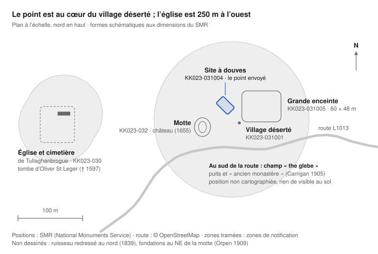

# Grove / Tullaghanbrogue (Co. Kilkenny) — le manoir des St Leger

Synthèse de recherche · 28 septembre 2026

**Le point envoyé est le site à douves KK023-031004, au cœur du village médiéval déserté de Tullaghanbrogue, townland de Grove, comté de Kilkenny (Irlande).** C'était le manoir anglo-normand des St Leger, du début du XIIIe siècle à 1653, rebaptisé « Cuffe's grove » en 1666. Le complexe est inscrit au registre légal des monuments : y avoir un détecteur, même éteint, est une infraction.

## Le site au point exact

Le point tombe sur le site à douves. La motte est à 49 m au sud-ouest, la grande enceinte à 56 m à l'est, l'église à 250 m à l'ouest.

| Distance | N° SMR | Monument | Ce que dit la fiche officielle |
| --- | --- | --- | --- |
| 0 m | [KK023-031004](https://heritagedata.maps.arcgis.com/apps/webappviewer/index.html?id=0c9eb9575b544081b0d296436d8f60f8&query=18a4b61b268-layer-9%2CSMRS%2CKK023-031004-) | Site à douves | Plate-forme rectangulaire de 22 × 10,7 m au sommet, haute de 0,47 m. Fossé de 1,95 m, chaussée d'accès possible au sud. |
| 35 m | [KK023-031001](https://heritagedata.maps.arcgis.com/apps/webappviewer/index.html?id=0c9eb9575b544081b0d296436d8f60f8&query=18a4b61b268-layer-9%2CSMRS%2CKK023-031001-) | Village médiéval déserté | Terrassements du village. Orpen (1909) : « the foundations of buildings are still traceable » au nord-est de la motte. |
| 49 m | [KK023-032](https://heritagedata.maps.arcgis.com/apps/webappviewer/index.html?id=0c9eb9575b544081b0d296436d8f60f8&query=18a4b61b268-layer-9%2CSMRS%2CKK023-032----) | Motte | 29 × 24,9 m à la base, 1,67 m de haut, large fossé. Une « bretage » plutôt qu'une motte classique pour Orpen. |
| 49 m | [KK023-093](https://heritagedata.maps.arcgis.com/apps/webappviewer/index.html?id=0c9eb9575b544081b0d296436d8f60f8&query=18a4b61b268-layer-9%2CSMRS%2CKK023-093----) | Château | Dessiné sur la carte du Down Survey (1655-6) à l'est de l'église. Plus rien de visible au sol. |
| 56 m | [KK023-031005](https://heritagedata.maps.arcgis.com/apps/webappviewer/index.html?id=0c9eb9575b544081b0d296436d8f60f8&query=18a4b61b268-layer-9%2CSMRS%2CKK023-031005-) | Grande enceinte | 48 × 60,5 m, talus large et plat au sud et à l'ouest. |
| 250 m | [KK023-030001](https://heritagedata.maps.arcgis.com/apps/webappviewer/index.html?id=0c9eb9575b544081b0d296436d8f60f8&query=18a4b61b268-layer-9%2CSMRS%2CKK023-030001-) | Église paroissiale | Ruine de 19,5 × 6 m. Tombe d'Oliver St Leger, « seigneur de Tullihanbrog », mort le 5 septembre 1597, et d'Ellen Comerford. |
| 260 m | [KK023-030002](https://heritagedata.maps.arcgis.com/apps/webappviewer/index.html?id=0c9eb9575b544081b0d296436d8f60f8&query=18a4b61b268-layer-9%2CSMRS%2CKK023-030002-) | Cimetière | « Roilig a Tulacháin », le cimetière du tertre (OS Letters, 1839). Entrée depuis la route publique. |

Fiches : [Sites and Monuments Record, National Monuments Service](https://services-eu1.arcgis.com/HyjXgkV6KGMSF3jt/ArcGIS/rest/services/SMROpenData/FeatureServer/0), version du 1er décembre 2025, licence CC BY 4.0. Google affiche « Grange Lower » : le townland officiel du point est Grove.

## Ce que dit la loi irlandaise

<strong>Sur ce site, avoir un détecteur sur soi est déjà une infraction, même éteint.</strong> Le complexe est inscrit au <a href="https://www.archaeology.ie/app/uploads/2025/03/Archaeology-RMP-Kilkenny-Manual-1996-0022.pdf">registre légal des monuments de Kilkenny (RMP, 1996)</a>, planche 023 : KK023-030, KK023-031 et KK023-032.

| Règle | Texte | Ce que ça veut dire ici |
| --- | --- | --- |
| Détecteur interdit sur un monument inscrit | [Loi de 1987, s.2(1)(a)](https://www.irishstatutebook.ie/eli/1987/act/17/section/2/enacted/en/html), point (iv) ajouté par la [loi de 1994, s.16](https://www.irishstatutebook.ie/eli/1994/act/17/section/16/enacted/en/html) | Utiliser ou simplement avoir sur soi un détecteur à Grove est un délit. |
| Recherche d'objets archéologiques interdite partout | Loi de 1987, s.2(1)(b) | Partout en Irlande, sans consentement écrit du ministre. Il n'est accordé qu'à des archéologues qualifiés. L'accord du propriétaire ne remplace pas ce consentement. |
| Promotion interdite | Loi de 1987, s.2(1)(c) | Promouvoir la détection d'objets archéologiques est aussi une infraction. |
| Trouvailles | [Loi de 1994](https://www.irishstatutebook.ie/eli/1994/act/17/enacted/en/html), s.2 et [s.19](https://www.irishstatutebook.ie/eli/1994/act/17/section/19/enacted/en/html) | Un objet archéologique trouvé appartient à l'État. Il doit être déclaré au National Museum sous 96 heures. |
| Travaux | [Loi de 1994, s.12](https://www.irishstatutebook.ie/eli/1994/act/17/section/12/enacted/en/html) | Tout travail sur un monument inscrit exige un préavis écrit de 2 mois. |

Peine citée par le [National Museum of Ireland](https://www.museum.ie/en-IE/Collections-Research/The-Law-on-Metal-Detecting-in-Ireland) pour le détecteur : jusqu'à 63 486 € d'amende et/ou 3 mois de prison. En mai 2023, un homme a été condamné à Dundalk à 1 000 € d'amende pour détention de plus de 60 objets archéologiques ([RTÉ](https://www.rte.ie/news/2023/0611/1388612-medieval-coins-dundalk/)). La loi de 2023 qui remplacera ces textes n'est pas encore en vigueur sur ces points ([NMS](https://www.archaeology.ie/licences/detection-device-consent)). L'Irlande n'a pas de droit d'accès aux terres : entrer dans un champ demande l'accord du propriétaire.

## Histoire : les dates clés

Les St Leger ont tenu le manoir plus de quatre siècles, d'environ 1202 à 1653. Les Cuffe l'ont ensuite intégré au domaine de Desart.

| Date | Ce qui se passe | Source |
| --- | --- | --- |
| 1202-1218 | William de St. Leger donne l'église Saint-Nicolas de « Thulachbroc » à l'abbaye St Thomas de Dublin, puis 5 carucates de terre sur place. Premiers actes connus du manoir. | [Carrigan 1905](https://archive.org/details/historyandantiq01carrgoog), vol. 3, p. 384-385 |
| 1221-1229 | William Marshal le Jeune donne la terre voisine de Tulachenny aux cisterciens de Duiske. Leur grange donne son nom à Grange. | Carrigan, p. 373 et 389-390 |
| XIIIe s. | Orpen range Tullaghanbrogue au centre de l'Ossory, « probably the latest part settled by the Anglo-Normans ». | [Orpen 1909](https://archive.org/details/thejournaloftheroyalsocirela5s19), p. 333 |
| 5 sept. 1597 | Mort d'Oliver St Leger, « seigneur de Tullihanbrog ». Sa tombe, avec Ellen Comerford, est dans l'église. | Carrigan, p. 385 |
| 5 sept. 1607 | Inquisition de Thomastown : Edmund Sentleger tient « le manoir et la ville de Tullaghanbroge », avec 1 château et 20 maisons. | [Repertorium, vol. 1 (1826)](https://archive.org/details/india.history.resource.77918) ; Carrigan, p. 387 |
| 1626-1627 | Nouvelle inquisition : Edmund est mort en 1625, son fils George, 22 ans, hérite. | Carrigan, p. 388 |
| 1653 | Confiscation cromwellienne des terres St Leger. | [SMR KK023-031001](https://heritagedata.maps.arcgis.com/apps/webappviewer/index.html?id=0c9eb9575b544081b0d296436d8f60f8&query=18a4b61b268-layer-9%2CSMRS%2CKK023-031001-) |
| 1655-1656 | Le Down Survey dessine un bâtiment, sans doute un château en ruine, à l'est de l'église de « Tullohaune ». | [SMR KK023-093](https://heritagedata.maps.arcgis.com/apps/webappviewer/index.html?id=0c9eb9575b544081b0d296436d8f60f8&query=18a4b61b268-layer-9%2CSMRS%2CKK023-093----) |
| 26 oct. 1666 | Concession à Joseph Cuffe : « Tullaghane (to be called and known for ever by the name of Cuffe's grove) ». D'où le nom Grove. | Carrigan, p. 389 |
| 1733 | Construction de Desart Court, résidence des Cuffe, futurs comtes de Desart, à 2 km au sud-ouest. | [NIAH 12402210](https://www.buildingsofireland.ie/buildings-search/building/12402210/desart-court-desart-demesne-kilkenny) |
| 1839 | L'Ordnance Survey décrit l'église en ruine et le cimetière « Roilig a Tulacháin ». | [SMR KK023-030001](https://heritagedata.maps.arcgis.com/apps/webappviewer/index.html?id=0c9eb9575b544081b0d296436d8f60f8&query=18a4b61b268-layer-9%2CSMRS%2CKK023-030001-) |
| 1923 | Desart Court est détruite pendant la guerre civile. | NIAH 12402210 |
| 1957 | Démolition de Desart Court. Seul le jardin clos subsiste. | NIAH 12402210 |

## La famille St Leger à Tullaghanbrogue

Les St Leger ont tenu Tullaghanbrogue pendant plus de quatre siècles. Carrigan (1905) reconstitue la lignée d'après les chartes, les pardons royaux et les inquisitions.

| Date | Membre de la famille | Ce que disent les sources |
| --- | --- | --- |
| 1202-1230 | William St. Leger, puis son fils William | Seigneurs de la paroisse. Ils donnent l'église et des terres à l'abbaye St Thomas de Dublin. |
| 1260-1286 | Geoffry St. Leger, évêque d'Ossory | Sans doute un proche parent (« we may presume », selon Carrigan). |
| 20 mai 1366 | John fitz John de St. Leger et sa femme Margaret | Un acte sur des terres à Kiltranin, Donfert et Kenlys. |
| 1526 | Edmund « Sieger » | Parmi les francs-tenanciers du comté de Kilkenny. |
| 1543 et 1569 | Patrick « Sentlegere » | Seigneur de « Tologhanbruwe ». Domaine estimé à 26 £ 13 s. 4 d. vers 1569. |
| 1574 | Edmund Sentleger, fils de Patrick | Reçoit un pardon royal. |
| 1584-1597 | Oliver St. Leger, fils ou frère d'Edmund | Seigneur de Tullaghanbroge, pardon en 1584, mort en 1597. Tombe dans l'église avec Ellen Comerford. |
| 1607-1625 | Edmund St. Leger, fils d'Oliver, époux d'Elizabeth | Tient le manoir, 2 châteaux (Tullaghanbroge et Lyslonyn) et une maison de pierre à Callan. Meurt à Tullaghanbroge le 10 octobre 1625. |
| 1625-1654 | George St. Leger, fils d'Edmund, 22 ans en 1625 | En 1641, tient « all the castles, towns and lands of Lissnonyne and Kilfechine ». Perd Tullaghane (876 acres) et Lislonen (520 acres) en 1653. Condamné en 1654 à la transplantation au Connaught. |
| 1653-1654 | Patrick St. Leger « of Derrin » | Perd Derrenetewke en 1653. Même ordre de transplantation en 1654. |
| 20 avril 1691 | Geoffry St. Leger « of Dizart (Desart) » et Patrick St. Leger « of Tullaghene » | Proscrits comme jacobites, partisans de Jacques II. |

En 1905, Carrigan note : « The St. Legers are now almost extinct in this locality ». Le nom se prononçait « Sallinger », en irlandais comme en anglais local. Source : [Carrigan, vol. 3, p. 385-389](https://archive.org/details/historyandantiq01carrgoog).

Ce dossier ne permet pas d'établir un lien avec une famille actuelle. Piste à creuser pour la généalogie : après 1691, beaucoup de jacobites irlandais ont rejoint la France. Rien ne dit ici que Geoffry ou Patrick en fassent partie.

## Lyslonine (Desart), le second château des St Leger

**Les St Leger avaient bien un second château à Lyslonyn, l'actuel Desart.** L'inquisition de 1607 le compte avec 8 maisons, et George St Leger y tient encore « all the castles » en 1641.

| Ce qu'on en dit | Ce que disent les sources | Verdict |
| --- | --- | --- |
| Un second château St Leger à Lyslonine | 1607 : « Lyslonyn and Kilfeahin, 1 castle, 8 messuages ». 1641 : « all the castles... of Lissnonyne » (Carrigan, p. 387-388). | Confirmé |
| À environ 5 km au sud-ouest de la motte | Desart Court est à environ 2,3 km au sud-ouest de la motte, le lios à 2,7 km (positions SMR). | Plus près : 2 à 3 km |
| Desart Court bâtie par les Cuffe | Vers 1733, pour John Cuffe, 1er baron Desart. Joseph Cuffe, « a Cromwellian », avait reçu les terres en 1666. | Confirmé. Le grade de capitaine n'apparaît dans aucune source consultée. |
| Bâtie sur l'ancien château de Lyslonine | Aucune source consultée ne situe le château de 1607. Wikipédia et le NIAH n'en disent rien. | Non établi |
| Ce château sur un ancien fort gaélique | Le lios, *Lios-Chluainín* (« le fort du petit pré »), est à 400 m au sud de Desart Court, pas dessous (Carrigan ; [SMR KK022-020](https://heritagedata.maps.arcgis.com/apps/webappviewer/index.html?id=0c9eb9575b544081b0d296436d8f60f8&query=18a4b61b268-layer-9%2CSMRS%2CKK022-020----)). | Fort confirmé, mais à côté |
| « Lys » ou « lios » veut dire enclos | Un *lios* est un fort circulaire à talus de terre qui entoure un habitat. | Confirmé |
| Incendiée par les Sinn Féiners en 1928 | Incendiée en février 1923 par l'IRA, pendant la guerre civile ([Wikipédia](https://en.wikipedia.org/wiki/Desart_Court) ; [NIAH](https://www.buildingsofireland.ie/buildings-search/building/12402210/desart-court-desart-demesne-kilkenny) : « destruction (1923) »). Rebâtie en 1926, démolie en 1957. | 1923, pas 1928 |
| Un bout de rempart dans une cour de ferme | En 2021, le SMR voit encore l'arc sud du talus du lios sur l'imagerie satellite, en pâture. Il ne mentionne pas de cour de ferme. | À vérifier sur place |

Le lios (KK022-020) et l'église Cill Féichín avec son enclos (KK022-021) sont inscrits au [RMP de 1996](https://www.archaeology.ie/app/uploads/2025/03/Archaeology-RMP-Kilkenny-Manual-1996-0022.pdf). Les mêmes règles qu'à Grove s'y appliquent : pas de détecteur.

## Ce que disent les noms de lieux

L'ancien nom désignait le lieu, le nom moderne l'efface. Tullaghanbrogue contient *tulchán*, « le petit tertre » ; Grove, « le bosquet », date de 1666.

| Nom | Irlandais | Ce qu'il dit |
| --- | --- | --- |
| Tullaghanbrogue (paroisse) | *Tulchán Bróg* | *Tulchán* = petit tertre. Formes du XIIIe s. : Thulachbroc, Tulachbroc. Un récit scolaire de 1937 le traduit « badger's hill » (*broc* = blaireau), non vérifié. |
| Grove | *An Garrán* ([logainm 26411](https://www.logainm.ie/en/26411)) | « Le bosquet ». Nom imposé par la concession de 1666 (« Cuffe's grove »). |
| Roilig a Tulacháin | *Roilig an Tulcháin* | « Le cimetière du tertre », nom local du cimetière en 1839. |
| Grange, Grangecuffe | *Gráinseach* | La grange des cisterciens de Duiske, reçue entre 1221 et 1229. |
| Desart | *Lios Loinín* (logainm) ou *Lios-Chluainín* (Carrigan) | Un *lios*, fort circulaire. Renommé « Cuffe's Desert » en 1666 : le rapprochement avec *díseart* (ermitage) reste non prouvé. |
| Castleinch or Inchyolaghan | *Inse Uí Uallacháin* | « Castle Inch », ajouté en 1666 : ici c'est l'anglais qui signale le château. |
| Church Hill | *Cnoc an Teampaill* | « La colline de l'église » : église médiévale de la Sainte-Croix, puits sacré. |
| Kyleandangan | *Coill an Daingin* | « Le bois de la forteresse » ; une enceinte y est recensée. |
| Raheenduff | *An Ráithín Dubh* | « Le petit fort noir » ; une grande enceinte y est recensée. |
| Aghenderry | *Achadh an Doire* | « Le champ du bois de chênes » : nom muet, pourtant un ringfort y est recensé. |

Piège à retenir : *Bally-* + nom de famille désigne un propriétaire, pas un monument (Ballykeefe, « la ville d'O'Keeffe », selon Carrigan).

## Autour du site, dans un rayon de 5 km

Le registre compte 134 monuments dans ce rayon, dont 35 enceintes, 12 églises, 11 cimetières, 5 puits sacrés et 5 fulachta fia (foyers de cuisson préhistoriques). Les plus parlants :

| Distance | Lieu | Monuments | Pourquoi c'est notable |
| --- | --- | --- | --- |
| 1,4 km E | Church Hill (Grange) | Église de la Sainte-Croix, cimetière, croix, puits sacré (KK023-036, KK023-094) | La chapelle catholique de 1826 a été bâtie avec les pierres de l'église médiévale. |
| 2,1 km SO | Desart Demesne | Enclos ecclésiastique double, église Cill Féichín, puits (KK022-021) | « An early medieval monastic church » selon le SMR, vu sur photo aérienne de 1968. |
| 2,2 km E | Ballybur Upper | Tower house des Comerford (KK023-039) | Tour de quatre niveaux, restaurée entre 1979 et 2006. Les Comerford sont alliés aux St Leger. |
| 2,3 à 3 km NNE | Castleinch or Inchyolaghan | Église St David, tombe à gisant, château (KK023-001 à -003), moulin (KK019-038) | Moulin à roue horizontale, examiné en mai 1955 pour le National Museum. |
| 3,3 km NE | Raheenapisha | Four à sécher le grain (KK023-174) | Fouillé en 2015-2016, daté au radiocarbone de 1020-1186 apr. J.-C. |
| 3,5 km SE | Farmley | Tower house et bawn des Fitzgerald (KK023-071) | Monument national n° 321. |

Les sites inscrits au RMP de 1996 sont protégés comme Grove. Ailleurs, chercher des objets archéologiques au détecteur reste interdit partout en Irlande.

## Ce qu'on peut faire, légalement

- **Lire l'histoire du lieu** : Carrigan 1905, vol. 3, p. 384-392, est en ligne en entier ([archive.org](https://archive.org/details/historyandantiq01carrgoog)). Chaque monument a sa fiche officielle, liens dans le tableau du site.
- **Voir le site** : l'entrée du cimetière et de l'église donne sur la route publique. Les terrassements sont dans un champ privé en herbe : il faut l'accord du propriétaire, et aucun détecteur sur soi.
- **Demander aux gens du lieu** : le Heritage Office du comté (heritage@kilkennycoco.ie) et la [Kilkenny Archaeological Society](https://kilkennyarchaeologicalsociety.ie/) (Rothe House, revue *Old Kilkenny Review*).
- **Participer** : fouilles et projets encadrés par des archéologues. Le [Community Monuments Fund](https://www.gov.ie/en/department-of-housing-local-government-and-heritage/publications/community-monuments-fund-2026-call-for-projects/) finance en 2026 la mise en valeur de monuments inscrits au RMP.
- **Trouvaille par hasard** (labour, promenade) : ne pas creuser davantage, déclarer au National Museum of Ireland sous 96 heures.

## Questions ouvertes

- Où étaient exactement le puits sacré et l'« ancien monastère » du champ « the glebe » (Carrigan 1905) ? Jamais cartographiés, rien de visible au sol.
- Le château des St Leger était-il sur la motte (SMR), ou à 200 yards au sud-est du cimetière, comme le dit un récit scolaire de 1937 ?
- Où se trouvait le château St Leger de Lyslonyn (1607) ? Aucune source consultée ne le situe.
- Que montrent la carte du Down Survey (1655-1656) et la carte OS au 1/10 560 de 1839 ? À regarder dans un navigateur.
- Que veulent dire les seconds éléments de Tullaghanbrogue (*bróg* ou *broc*) et de Desart (*Loinín* ou *Cluainín*) ?
- Qui était « George Comerford de Tullaghanbroge », cité vers 1635 ?
- Relief : aucun LiDAR ouvert ne couvre Grove dans les 9 index du Geological Survey Ireland.

## Sources

**Monuments et lois.** [Sites and Monuments Record, open data](https://services-eu1.arcgis.com/HyjXgkV6KGMSF3jt/ArcGIS/rest/services/SMROpenData/FeatureServer/0) · [fiche KK023-031004](https://heritagedata.maps.arcgis.com/apps/webappviewer/index.html?id=0c9eb9575b544081b0d296436d8f60f8&query=18a4b61b268-layer-9%2CSMRS%2CKK023-031004-) · [zones de notification](https://services-eu1.arcgis.com/HyjXgkV6KGMSF3jt/ArcGIS/rest/services/SMRZoneOpenData/FeatureServer) · [RMP de Kilkenny, liste (1996)](https://www.archaeology.ie/app/uploads/2025/03/Archaeology-RMP-Kilkenny-Manual-1996-0022.pdf) et [cartes](https://www.archaeology.ie/app/uploads/2025/03/Archaeology-RMP-Kilkenny-Map-1996-0023.pdf) · [loi de 1987, s.2](https://www.irishstatutebook.ie/eli/1987/act/17/section/2/enacted/en/html) · [loi de 1994](https://www.irishstatutebook.ie/eli/1994/act/17/enacted/en/html) · [loi de 2023](https://www.irishstatutebook.ie/eli/2023/act/26/enacted/en/html) · [NMS, consentement détecteur](https://www.archaeology.ie/licences/detection-device-consent) · [NMS, législation](https://www.archaeology.ie/advice-and-support/legislation/) · [National Museum of Ireland](https://www.museum.ie/en-IE/Collections-Research/The-Law-on-Metal-Detecting-in-Ireland) · [RTÉ, 11 juin 2023](https://www.rte.ie/news/2023/0611/1388612-medieval-coins-dundalk/) · [Irish Examiner](https://www.irishexaminer.com/news/arid-41159953.html) · [Community Monuments Fund 2026](https://www.gov.ie/en/department-of-housing-local-government-and-heritage/publications/community-monuments-fund-2026-call-for-projects/) · [Kilkenny Heritage Office](https://kilkennyheritage.ie/2014/12/329/).

**Histoire.** [Carrigan, *History and antiquities of the diocese of Ossory*, vol. 3 (1905)](https://archive.org/details/historyandantiq01carrgoog) · [Orpen, « Motes and Norman castles in Ossory », JRSAI 39 (1909)](https://archive.org/details/thejournaloftheroyalsocirela5s19) · [*Inquisitionum... repertorium*, vol. 1 (1826)](https://archive.org/details/india.history.resource.77918) · [Lewis 1837, via GENUKI](https://www.genuki.org.uk/big/irl/KIK/Tullaghanbrogue) · [index de Griffith's Valuation](https://www.failteromhat.com/griffiths/kilkenny/tullaghanbrogue.php) · [Landed Estates Database, Cuffe](https://landedestates.ie/estate/3269) · [Wikipédia, Desart Court](https://en.wikipedia.org/wiki/Desart_Court) et [Earl of Desart](https://en.wikipedia.org/wiki/Earl_of_Desart) · [NIAH, Desart Court](https://www.buildingsofireland.ie/buildings-search/building/12402210/desart-court-desart-demesne-kilkenny) · [Kilkenny Library, incendies de 1923](https://kilkennylibrary.ie/eng/our_services/decade-of-centenaries-resources/big-house-burnings-1923/) · [Kilkenny Archaeological Society, tombes de Cuffesgrange](https://kilkennyarchaeologicalsociety.ie/wp-content/uploads/2019/08/cuffesgrange-church-hill-kas.pdf) · [IrishHistory.com, « Moated site, Grove »](https://irishhistory.com/places/moated-site-grove-co-kilkenny/).

**Noms de lieux et folklore.** [logainm.ie, Grove (26411)](https://www.logainm.ie/en/26411) · [townlands.ie, paroisse de Tullaghanbrogue](https://www.townlands.ie/kilkenny/tullaghanbrogue1/) · [Joyce, *Irish Names of Places*](https://www.libraryireland.com/IrishPlaceNames/) · dúchas.ie, écoles de [Church Hill](https://www.duchas.ie/en/cbes/4758534), [Desart](https://www.duchas.ie/en/cbes/4758532) et [Burnchurch](https://www.duchas.ie/en/cbes/4758533) · [OpenStreetMap, route L1013](https://www.openstreetmap.org/way/349479266).

**Cartes, relief et bâti.** [NIAH, open data](https://services-eu1.arcgis.com/HyjXgkV6KGMSF3jt/ArcGIS/rest/services/NIAHBuildingsOpenData/FeatureServer) · [index LiDAR du Geological Survey Ireland](https://gsi.geodata.gov.ie/server/rest/services/Lidar) · [Open Topographic Lidar Data](https://data.gov.ie/dataset/open-topographic-lidar-data) · [EPA](https://gis.epa.ie/geoserver/) · [Taylor et Skinner (1778)](https://archive.org/details/TaylorSkinnerMapsOfTheRoadsOfIrelandSurveyed1777) · [Cambridge Air Photos](https://www.cambridgeairphotos.com).

**À ouvrir dans un navigateur (non consultées).** [Down Survey](https://downsurvey.tcd.ie/) · [cartes historiques GeoHive](https://webapps.geohive.ie/mapviewer/index.html) · [OS Ireland 6-inch, NLS](https://maps.nls.uk/os/6inch-ireland/) · [Griffith's Valuation](https://www.askaboutireland.ie/griffith-valuation/) · [recensements 1901 et 1911](https://www.census.nationalarchives.ie/) · OS Letters de Kilkenny (1839) · *Calendar of Ormond Deeds* · *Irish Fiants* · O'Kelly, *The place-names of County Kilkenny* (1969) · [Barry, *The Medieval Moated Sites of South-Eastern Ireland* (1977)](https://www.fulcrum.org/concern/monographs/gt54kp717).

**Dossier complet** (documents et fichiers de données) : [github.com/Engue75/treasure-detector-meylargues, docs/zones/grove-kilkenny](https://github.com/Engue75/treasure-detector-meylargues/tree/claude/texture-research-new-location-7y49il/docs/zones/grove-kilkenny).
